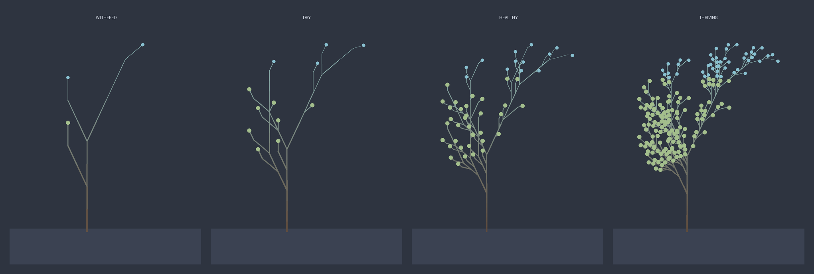

# Epiphyte 🌱

**A Discord bot that grows a single living plant from your channel's activity.**

Every message waters the plant; silence lets it wither over days. Epiphyte is
not a utility bot — it is a small art project with an honest side effect: the
plant shows, unvarnished, how alive a channel really is.

<p align="center">
  
</p>

## What it is, and why

Give Epiphyte one channel and it renders **one plant** for that server. People
talking keeps it lush; a quiet channel lets it dry out and wither. Nothing to
click, nothing to maintain — the plant simply mirrors the room.

The catch that makes it honest: you cannot fake a thriving plant. A single
person spamming the channel hits **diminishing returns** and cannot keep it
alive on their own — only genuine activity from several people can. The plant is
a mirror, not a scoreboard.

Every server gets its own isolated plant — there is no shared, cross-server
world.

## How it works

- **Watering** — each message in the chosen channel adds a little moisture.
- **Withering** — moisture decays exponentially; left in silence, the plant
  falls from thriving to withered over roughly three days.
- **Growth** — moisture maps to a growth stage, and the stage drives an
  [L-system](https://en.wikipedia.org/wiki/L-system) that is turtle-interpreted
  and rendered to an image. More moisture → a deeper, bushier plant.
- **Fairness** — repeated watering by the same person within a window yields
  progressively less, so no one can farm the plant by flooding.
- **Privacy** — the bot only needs to know *that* a message arrived, never
  *what* it said. It reads no message content and requests **no privileged
  gateway intents**.

The four growth stages, driest to lushest — `Withered → Dry → Healthy →
Thriving`:



## Quickstart

You will need Python 3.11+ and a Discord bot token. From an empty server this
takes well under ten minutes.

### 1. Create the bot and get a token

1. Open the [Discord Developer Portal](https://discord.com/developers/applications)
   and create a **New Application**.
2. Go to **Bot** and click **Reset Token** to reveal the token. Keep it secret —
   you will pass it to Epiphyte as an environment variable.
3. No privileged intents are required, so leave **Message Content Intent**,
   **Server Members Intent** and **Presence Intent** switched **off**.

### 2. Invite the bot to your server

Under **OAuth2 → URL Generator**, select the scopes `bot` and
`applications.commands`, and the permissions **View Channels**, **Send
Messages**, **Embed Links** and **Attach Files**. Open the generated URL and add
the bot to your server.

Equivalently, use this URL with your application's client id:

```
https://discord.com/api/oauth2/authorize?client_id=YOUR_CLIENT_ID&scope=bot%20applications.commands&permissions=52224
```

### 3. Install and run

```bash
git clone https://github.com/timur-manjosov/epiphyte.git
cd epiphyte

python -m venv .venv
source .venv/bin/activate
pip install -r requirements.txt

export EPIPHYTE_TOKEN="your-bot-token"
# Optional: makes slash commands appear instantly in one test server
export EPIPHYTE_GUILD_ID="your-server-id"

python bot.py
```

On first run the bot creates a SQLite file (`epiphyte.db`) in the working
directory to remember each server's plant across restarts.

### 4. Use it in Discord

1. **`/epiphyte-channel #channel`** — choose the channel that waters the plant.
   Until this is set, messages are ignored.
2. Chat in that channel — every message quietly waters the plant.
3. **`/plant`** — see the plant as it stands right now.

## Configuration

Epiphyte is configured entirely through environment variables; no secret ever
lives in the code or repository.

| Variable | Required | Purpose |
|---|---|---|
| `EPIPHYTE_TOKEN` | yes | The Discord bot token. |
| `EPIPHYTE_GUILD_ID` | no | A test server id. If set, slash commands appear there instantly; otherwise they are registered globally and can take up to an hour to propagate. |

## Commands

| Command | What it does |
|---|---|
| `/epiphyte-channel #channel` | Set the channel whose messages water the plant. |
| `/plant` | Render and show the plant's current state (image + moisture + stage). |

## Development

The pure logic — moisture decay and the anti-farming curve (`moisture.py`) and
the L-system expansion and turtle interpreter (`lsystem.py`) — is tested with
pytest and depends on neither Discord nor Pillow. Rendering (`render.py`) is
isolated Pillow I/O, and persistence (`storage.py`) is isolated SQLite I/O.

```bash
pip install -r requirements-dev.txt
pytest              # run the pure-logic tests
python -c "import bot"   # token-free smoke test: the module imports cleanly
```

See [CONTRIBUTING.md](CONTRIBUTING.md) for the project structure, conventions and
design guidelines.

## Built with

Python, [discord.py](https://github.com/Rapptz/discord.py) (slash commands only,
`discord.Client` + a `CommandTree`), [Pillow](https://python-pillow.org/) for
rendering, and SQLite from the standard library. Colours follow the
[Nord](https://www.nordtheme.com/) palette.

## License

[MIT](LICENSE) © 2026 Timur Manjosov
