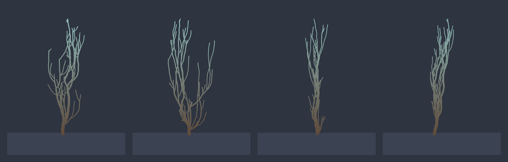
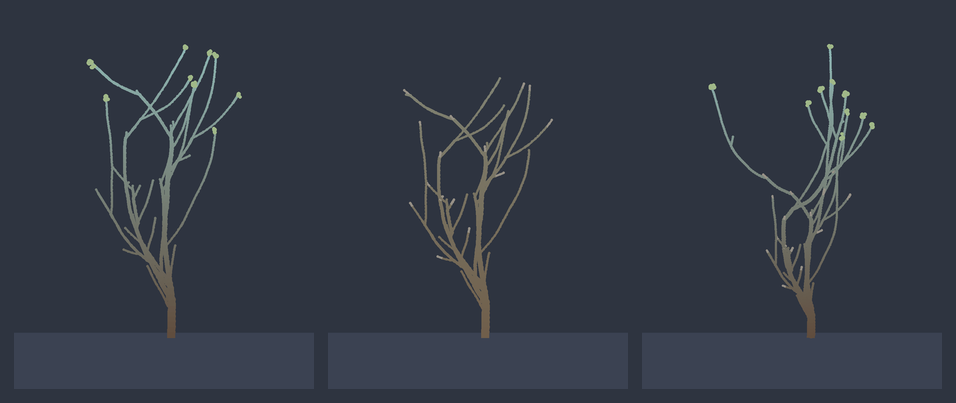
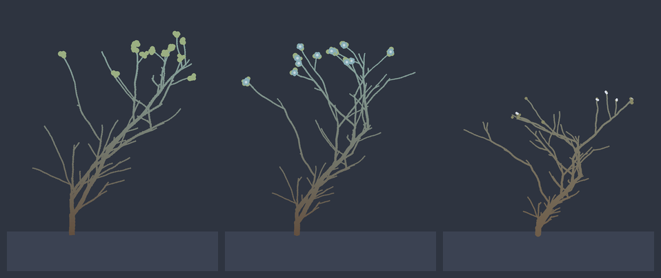
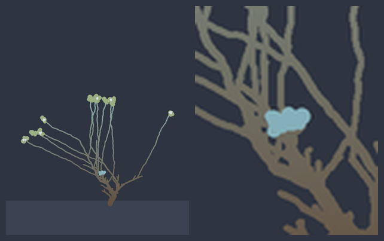
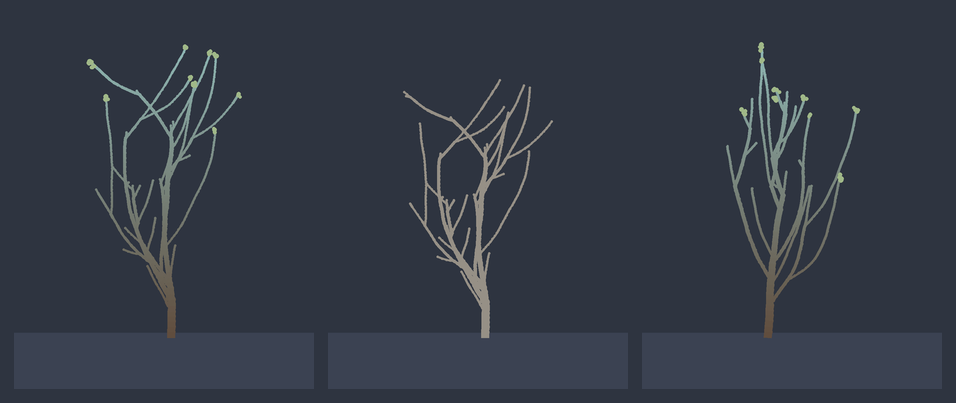

# Epiphyte 🌱

**A Discord bot that grows one living plant from your server's activity.**

Every message anywhere in the server waters it. Silence lets it wither. A long
enough drought kills branches for good, and the scars stay. Epiphyte is not a
utility bot; it is a small art project with an honest side effect — the plant
shows, unflatteringly, how alive a server actually is.

<p align="center">
  
</p>

## The thesis

**One server, one plant, one continuously accumulating measure of vitality.**
Everything else in this project is derived from that single mechanic — never a
second feature bolted on beside it.

The important word is *accumulating*. The plant is not a gauge that reads out
current moisture; it is the sum of its whole life. Growth is permanent, and so
is death: a branch a drought killed in March is still a bare grey scar in
September, long after the leaves came back. Two plants at identical moisture
will not look alike, because they did not live alike.

There is no final form and no win state. The plant grows, can die, and its line
continues in a mutated successor. Every server gets its own isolated plant —
there is no shared cross-server world, and nothing to compare against anyone
else.

## What it refuses to do

These are not defaults awaiting a config flag. They are the design.

- **Three commands, total** — `/plant`, `/epiphyte-channel`, `/help`. That
  number is meant to stay small for the lifetime of the project.
- **No settings, no themes, no options.** Everything about how the plant looks
  and what it says is *derived* from state. If it could be chosen, it would stop
  being a measurement. The one button in the project — the readings toggle on
  `/plant` — is not an exception to this: it is a momentary way of looking at one
  private snapshot, stored nowhere, changing nothing for anyone else.
- **No leaderboard, ever.** The plant is a mirror, not a scoreboard. It says
  nothing about who talked most.
- **No privileged gateway intents.** `discord.Intents.default()` is the whole
  ask — no Message Content, no Server Members, no Presence. The bot knows *that*
  a message arrived, never what it said.
- **Nothing farmable by one person.** Every signal below either caps a single
  account's contribution or requires several people at once. That constraint is
  a precondition for admitting a signal at all, not a patch applied afterwards.
- **Depth comes from rules and time, not from commands.** Richness lives in the
  system's behaviour over weeks; the surface stays narrow.

## Six ways a server shows up in the plant

Six independent honest signals feed the same organism, each moving a *different*
part of it. They do not interfere: crown width, angle noise, branching depth,
bloom vividness and the root system are separate levers, and the base mechanic
gates all of it.

| What the server does | What it grows | Why it can't be farmed |
|---|---|---|
| **Messages** anywhere in the server | Moisture, and the growth it gates | Repeat watering by one person decays within a window — one account's total per window is bounded no matter how much it posts |
| **How many different people** talk | Crown breadth — a wider, bushier canopy | A voice only registers after it has held presence across several real days; fresh accounts today count for nothing |
| **How evenly** they talk over 8 weeks | Growth form — calm and symmetric, or gnarled | Measured as evenness across days, which is scale-invariant: volume buys nothing, only genuine spread |
| **Reactions**, sampled once as a bloom opens | Bloom vividness — sparse pale flowers, or colour everywhere | Self-reactions count zero; a clique trading reactions only ever counts as its own headcount |
| **Threads** that become real conversations | Branching depth — more deeply nested structure | A thread needs ≥2 people, each posting more than once, spread over ≥30 minutes |
| **Shared voice time** | A root system and a thickening trunk foot | Time only runs while ≥2 people are *audibly* in one channel — one person alone generates exactly nothing, for any number of hours |

A few of these deserve more than a table row.

**Breadth vs. rhythm are genuinely different questions.** Breadth asks *how many
voices*; rhythm asks *how evenly spread over time*, regardless of headcount. A
server carried by two people every single day and a server with a dozen people
who only appear on Saturdays grow visibly different bodies — one calm and even,
one knotted — at the same size.

**Threads only ever help.** Most servers never use threads, and that must never
count against them permanently. Depth moves from neutral upward only; a server
with no threads renders exactly as it always did.

**The roots are meant to stay hidden.** Everything else happens in writing,
where anyone scrolling can see it. Time spent talking together in voice is the
half of a server's life nobody sees, so it grows the half of a plant nobody
sees. Nothing appears at all below a real threshold of sustained shared time,
and then it emerges slowly. Sitting muted, deafened, or parked in the AFK
channel counts precisely as much as not being connected. **Epiphyte never joins
a voice channel and never receives, records or listens to any audio** — there is
no code in it that could. It sees voice state, the same thing your own client
shows you.

Same rules, different seeds — four mature plants, each an individual:



## A body that keeps the record

Vitality and body are separate things, and that separation is the whole point.

- **Leaves and posture follow the moment.** They flush on living tips when
  moisture is high, fall when it drops, and the plant droops when parched.
- **Growth and death do not.** On a steady hourly heartbeat the bot grows the
  plant one step, gated by moisture — so a full tree is the reward of *weeks* of
  sustained activity, never one busy evening. What grows, stays.
- **A prolonged drought kills wood.** Branches die back from the tips inward and
  are never removed or revived. The recovery is real; so is the scar.



Kept genuinely healthy for weeks, the plant banks that health and eventually
comes into **bloom**, in a colour its own genome chose. Flowering then spends
the very reserve that bought it, so the bloom fades on its own and the next one
must be earned again — a season, not a switch. A bloom held long enough **sets
seed**, and those pale heads stay on the body long after the colour is gone.



The rarest state is the one the project is named after. A tree grown very old
and very large, that has flowered several times over, can take on **an epiphyte
of its own**: a second, far smaller plant that settles on one of its old limbs
and grows there, with its own seed and a dwarfed genome. It cannot be hurried.



And when neglect is total, the inner wood dies too. The plant dies, lingers a
while as a bare grey skeleton, then a new seed sprouts in its place — a mutation
of the one before, recognisably related and unmistakably its own individual. A
plant that lived long enough to set seed hands on a richer line.



## It speaks for itself

The plant describes its own condition in the **first person** — thirst, drought,
the wood a dry spell cost it, the flowering it can finally afford. It never
mentions channels, messages, servers or bots; it has no idea it is software.

> "I have just broken the soil. Everything above me is new."

> "I am not the one that stood here. I came out of its seed, and I am small again."

> 🌸 "I opened because I could afford to, sparingly. When I no longer can, I will close."

Every state has a pool of at least eight phrasings, and which one you get is
chosen deterministically from the plant's own seed — not from `random`. Two
consequences follow, and both are the point: two servers rarely hear the same
sentence, and **a restart never changes what your plant is saying.** New text
appears only when something real changes — a size class reached, a moisture band
crossed, a death, a bloom. An ordinary heartbeat leaves the words exactly where
they were, because a plant that re-narrates itself every hour reads as erratic
rather than alive.

Operational messages — permissions, setup, `/help` — stay deliberately plain.
Nobody debugging a channel binding should have to decode poetry.

## The message in the channel is the plant, and nothing else

The living message carries a **full-size picture, the plant's own words, and a
colour read off its condition.** No moisture percentage, no stage, no age, no
node count. That message is the one surface nobody opted into — it sits in a
channel people are using for something else and redraws itself every hour — and a
number beside a picture is the one thing guaranteed to be read instead of it.

The colour is still a readout, and still its own per event: leaf green when
steady, sky blue when flourishing, gold at first thirst, brown in drought, red
while a drought is actively costing wood, grey at death — and the plant's *own*
flower colour while it is in bloom. Beneath it, one quiet constant: a
seed-derived sigil, generation, and age in days.

Like everything else here, it is derived, not chosen. There is no theme to pick.

### The readings are one button away

Every instrument that used to sit beside the picture still exists — all of it
moved behind a button on `/plant`, which is private to whoever ran it. Press
**Readings** and the same message turns over: the plant steps back to a
thumbnail, and every measurement the plant currently has appears at once —
moisture, stage, age, growing tips, wood lost, and, where the plant has actually
earned them, its flowerings, its passenger, the line behind it, and its finished
years. Press **The plant** and it turns back.

Both faces are built from a single reading of the state, so the numbers always
describe the same instant as the picture beside them; it is a snapshot, not a
live gauge. The button greys itself out after three minutes and leaves nothing
behind. This is not a setting: it changes nothing for the next person who looks,
and the channel message never has a button at all.

## Two things that are not signals

Both of these are deliberately *not* in the table above, and neither changes how
the plant grows by a single node.

**Once a year, the rings.** For one day when a calendar year turns, the plant
stops showing itself and shows a cross-section of its own trunk: one ring per
finished year, read from the centre outward. A year lived well is a wide dark
band; a quiet stretch is thin and pale; a year a drought cost it wood is a grey
scar ring — the same drought that left the grey branches on the ordinary
picture, seen from the other angle. The year in progress is never drawn, because
a ring is finished wood. This is not a seventh dimension; it is the same history
the plant already lived, read backward for a day. A new generation starts its
rings over, since no trunk can contain a year in which it did not exist.

**A little wind.** While somebody in the server is typing, the crown leans a few
pixels — a minute and a half after the last keystroke it stands still again. It
is the smallest thing in the project and deliberately the least significant: it
measures nothing, stores nothing, and is gone from memory on restart. Two people
typing stir exactly as much air as one. Nothing is redrawn for it either — it
only appears in a picture that was already being drawn, so it is something you
catch rather than something you are shown. It is weather over the plant, not
part of it.

## Quickstart

You need Python 3.11+ and a Discord bot token. From an empty server this takes
well under ten minutes.

### 1. Create the bot and get a token

1. Open the [Discord Developer Portal](https://discord.com/developers/applications)
   and create a **New Application**.
2. Go to **Bot** and click **Reset Token** to reveal it. Keep it secret — it
   reaches Epiphyte only as an environment variable.
3. Leave **Message Content Intent**, **Server Members Intent** and **Presence
   Intent** switched **off**. Epiphyte needs none of them.

### 2. Invite the bot

Under **OAuth2 → URL Generator**, select the scopes `bot` and
`applications.commands`, and the permissions **View Channels**, **Send
Messages**, **Embed Links** and **Attach Files**.

Equivalently, use this URL with your application's client id:

```
https://discord.com/api/oauth2/authorize?client_id=YOUR_CLIENT_ID&scope=bot%20applications.commands&permissions=52224
```

### 3. Install and run

```bash
git clone https://github.com/timur-manjosov/epiphyte.git
cd epiphyte

python -m venv .venv
source .venv/bin/activate
pip install -r requirements.txt

export EPIPHYTE_TOKEN="your-bot-token"
# Optional: makes slash commands appear instantly in one test server
export EPIPHYTE_GUILD_ID="your-server-id"

python bot.py
```

On first run the bot creates a SQLite file (`epiphyte.db`) in the working
directory, so each server's plant survives restarts.

### 4. Use it

1. **`/epiphyte-channel #channel`** — choose where the plant lives. The bot
   posts its living message there straight away. Until this is set, messages are
   ignored.
2. **Chat anywhere in the server.** Every message quietly waters the plant; it
   grows and withers in that one message on its own, over days, with nobody
   watching.
3. **`/plant`** *(optional)* — a private snapshot right now, with a button for
   every reading behind it, and a nudge to bring the living message back down if
   it has scrolled away.

## Configuration

Entirely environment variables. No secret ever lives in the code or repository.

| Variable | Required | Purpose |
|---|---|---|
| `EPIPHYTE_TOKEN` | yes | The Discord bot token. |
| `EPIPHYTE_GUILD_ID` | no | A test server id. If set, slash commands appear there instantly; otherwise they register globally and can take up to an hour to propagate. |

## Commands

| Command | What it does |
|---|---|
| `/epiphyte-channel #channel` | Choose the channel the plant is displayed in, and post its living message there. Requires **Manage Channels** or **Administrator**. |
| `/plant` | Show a private snapshot now, with a button that turns it over to every reading behind it, and re-anchor the living message if it has scrolled away. Never grows the plant — the heartbeat does that. |
| `/help` | A private, paginated explanation, in five pages: what Epiphyte is, what it reads, its commands, what arrives on its own, and what is permanent. |

## Two clocks

Worth knowing if you self-host, because it determines what downtime costs you:

- **Moisture decays lazily** from a stored timestamp, computed exactly from
  elapsed real time whenever it is read. It survives downtime perfectly — a
  quiet week away still shows, whether or not the bot was up for it.
- **Growth advances in discrete steps** on the hourly heartbeat, gated by
  moisture. It only happens while the bot is running.

So a bot that was offline does not fake a healthy plant. It just didn't grow.

## Development

The pure logic depends on neither Discord nor Pillow and is tested with pytest:
moisture decay and the anti-farming curve (`moisture.py`); genome, growth,
dieback, lifecycle, milestones, author breadth, temporal rhythm, thread depth,
voice activity, the yearly rings and the wind (`structure.py`); everything the
plant says about itself (`voice.py`); and the shape and colour of the message it
says it in (`presentation.py`). Rendering (`render.py`) is isolated Pillow I/O
and persistence (`storage.py`) isolated SQLite I/O.

```bash
pip install -r requirements-dev.txt
pytest                   # the pure-logic tests
python -c "import bot"   # token-free smoke test: the module imports cleanly
```

Both the voice and the frame have standing design documents in
[CLAUDE.md](CLAUDE.md): *"Die Stimme der Pflanze"* covers the plant's register,
what it never says, which messages are spoken in character and which stay plain,
and why the text holds still between heartbeats; *"Präsentation"* covers how
each life event gets its own colour and layout, and why none of it is
configurable. Read the relevant one before touching any line the plant speaks,
or any message it speaks in.

See [CONTRIBUTING.md](CONTRIBUTING.md) for structure, conventions and design
guidelines.

## Deployment

A `Dockerfile` and `docker-compose.yml` are included. See [DEPLOY.md](DEPLOY.md)
for the exact steps.

## Built with

Python, [discord.py](https://github.com/Rapptz/discord.py) (slash commands only,
`discord.Client` + a `CommandTree`), [Pillow](https://python-pillow.org/) for
rendering, [APScheduler](https://github.com/agronholm/apscheduler) for the
metabolic tick, and SQLite from the standard library. Colours follow the
[Nord](https://www.nordtheme.com/) palette.

## License

[MIT](LICENSE) © 2026 Timur Manjosov
